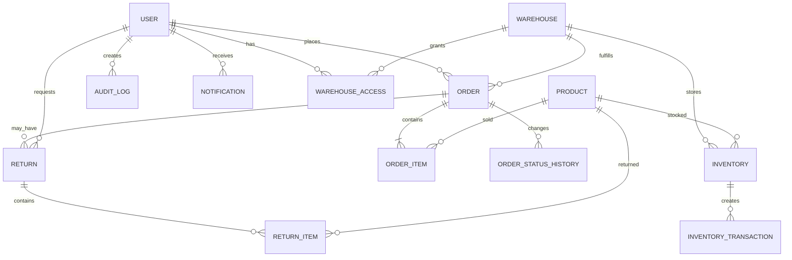

# ER Diagram

```mermaid
erDiagram
 USER ||--o{ ORDER : places
 USER ||--o{ AUDIT_LOG : creates
 USER ||--o{ NOTIFICATION : receives
 USER ||--o{ WAREHOUSE_ACCESS : has
 WAREHOUSE ||--o{ WAREHOUSE_ACCESS : grants
 WAREHOUSE ||--o{ INVENTORY : stores
 PRODUCT ||--o{ INVENTORY : stocked
 INVENTORY ||--o{ INVENTORY_TRANSACTION : creates
 WAREHOUSE ||--o{ ORDER : fulfills
 ORDER ||--|{ ORDER_ITEM : contains
 PRODUCT ||--o{ ORDER_ITEM : sold
 ORDER ||--o{ ORDER_STATUS_HISTORY : changes
 ORDER ||--o{ RETURN : may_have
 RETURN ||--o{ RETURN_ITEM : contains
 PRODUCT ||--o{ RETURN_ITEM : returned
 USER ||--o{ RETURN : requests
```
